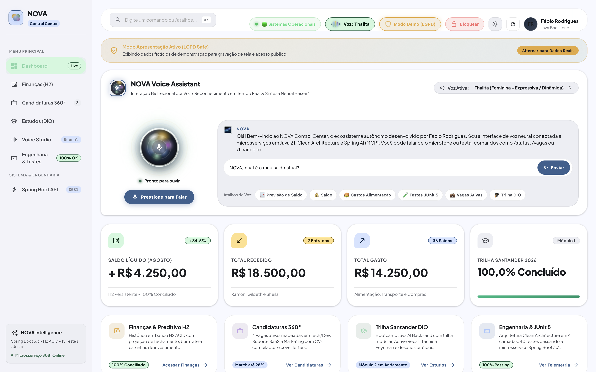
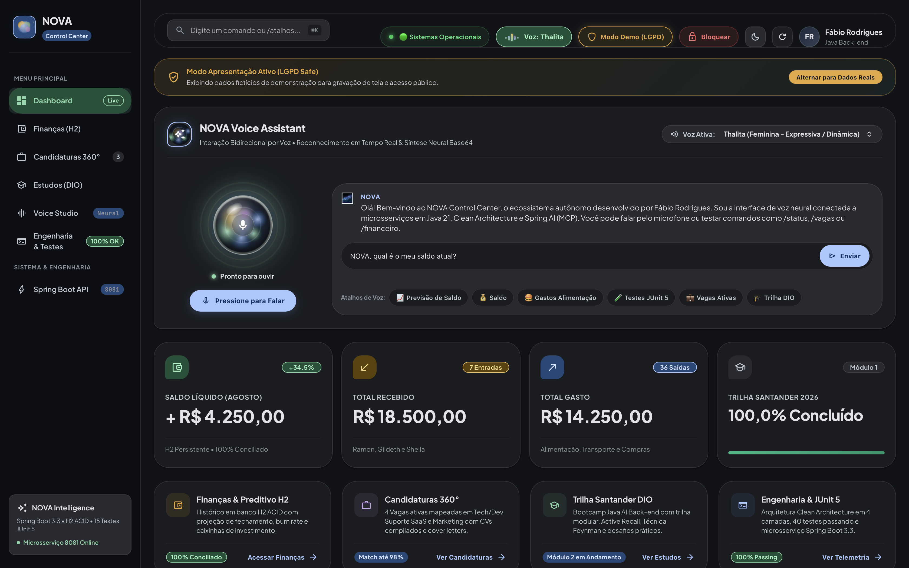
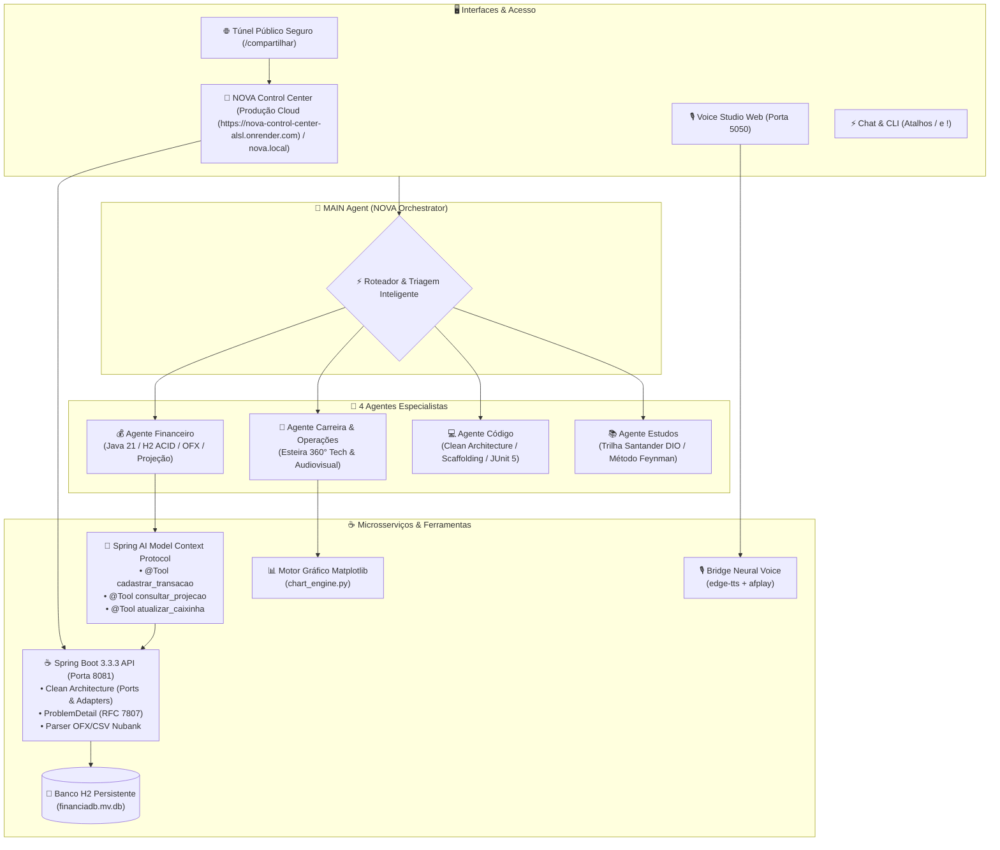

# 🌌 NOVA — Sistema Multi-Agente Pessoal & Profissional

[](https://github.com/fabiorodrigues-tech-dev/NOVA/actions)


[](https://nova-control-center-alsl.onrender.com)

> **Enterprise-Grade Multi-Agent Copilot & Autonomous Engineering Ecosystem**  
> Desenvolvido por **Fábio Rodrigues** (Recife/PE) | [LinkedIn](https://linkedin.com/in/fabiorodrigues-dev)

O **NOVA** é um ecossistema multi-agente pessoal e profissional orientado a microsserviços, inteligência artificial autônoma e engenharia de software de alta performance. Desenvolvido sob rigorosos princípios de **Clean Architecture (Ports & Adapters)**, **SOLID** e **DevSecOps**, o sistema integra o **Gemini via Google Antigravity**, microsserviço **Java 21 / Spring Boot 3.3.3**, protocolo **Spring AI Model Context Protocol (MCP)**, camada de **Voz Neural Humana** de baixa latência e o **NOVA Control Center** (Dashboard Executivo com Material 3 Expressive, Living Shader WebGL e Sistema de Privacidade LGPD).

---

## 📄 Destaques de Arquitetura & Documentação Oficial
Consulte os documentos executivos em PDF com pareceres de engenharia, diagramas e evidências de qualidade:
- 📑 **[Manual de Engenharia & Arquitetura (PDF Completo)](docs/Manual_Engenharia_e_Arquitetura_NOVA.pdf)**: Manual com especificação de camadas, RFC 7807, ferramentas `@Tool` MCP, pirâmide de testes e fórmulas preditivas.
- 🏆 **[Dossiê Técnico Master (PDF)](docs/dossie_tecnico_nova.pdf)**: Relatório executivo consolidado para avaliação por Tech Leads e Arquitetos de Software.

---

## 🧭 NOVA Control Center (UI Showcase & Production Preview)

O **NOVA Control Center** é a interface executiva e centro de comando unificado do ecossistema NOVA. Construído como uma Single Page Application (SPA) de alta performance, integra visualização preditiva de métricas, telemetria em tempo real, inteligência artificial multimodal por voz e controle granular de governança de dados.

### 🌐 Ambientes de Acesso & Demonstração

- 🚀 **Produção Cloud Live:** [https://nova-control-center-alsl.onrender.com](https://nova-control-center-alsl.onrender.com)
- 💻 **Execução Local:** [http://localhost:3000](http://localhost:3000) (ou `http://nova.local:3000` via `./start-all.sh`)
- ⚡ **Atalho no Chat:** Digite `/dashboard` ou `/painel`

---

### 🏛️ Matriz de Módulos & Abas Dedicadas (SPA View Switcher)

| Módulo / Aba | Escopo Técnico & Funcionalidades | Integrações & Tecnologias |
| :--- | :--- | :--- |
| **Cockpit Central** | Visão executiva consolidada, Voice Assistant interativo, KPIs corporativos e living shader reativo. | WebGL, Web Speech API, Chart.js, Bento Grid |
| **Finanças (H2)** | Balanço patrimonial, auditoria de despesas, burn rate diário, projeção de fechamento e gestão de Caixinhas. | Java 21, Spring Boot 3, Banco H2 ACID, OFX/CSV Nubank |
| **Candidaturas 360°** | Rastreamento de vagas ativas, índices de aderência técnica (Match %), filtros por trilha e exportação de dossiês. | Harvard Tech ATS, Dossiês PDF/DOCX, Matplotlib Engine |
| **Estudos & Certificações** | Monitoramento de trilhas ativas (Santander 2026 DIO 26/26 e Full Stack Cloud DevOps 5/5), emissão de certificados e resumos. | Metodologias Ativas, Feynman Engine, Markdown Renderer |
| **Voice Studio Pro** | Laboratório de síntese vocal neural, catálogo de vozes PT-BR/globais, análise de latência e testes executivos. | Python 3, Microsoft edge-tts, Audio Buffer Stream |
| **Spring Boot API Explorer** | Painel interativo de contratos REST, documentação de endpoints, inspeção de esquemas JSON e status dos serviços. | Springdoc OpenAPI, RFC 7807 ProblemDetail, Spring AI MCP |

---

### ⚙️ Pilares de Engenharia & Arquitetura de Software

- 🎨 **Design System Material 3 Expressive & Bento Grid:** Arquitetura visual modular construída com hierarquia tonal semântica, grid flexível responsivo e WebGL Living Shader interativo que reflete o estado do ecossistema em tempo real.
- 👁️ **Acessibilidade WCAG AAA & Telemetria em Tempo Real:** Paleta cromática validada com taxas de contraste rigorosas (WCAG AAA), navegação universal assistida por teclado, tooltips de contexto e telemetria pulsante no cabeçalho monitorando a saúde dos microsserviços integrados.
- 🛡️ **DevSecOps & Zero-Trust Data Protection:** Isolamento de segredos, proteção CSRF/CORS estrita, cabeçalhos de segurança padronizados e esteira de CI/CD automatizada com GitHub Actions para validação contínua de integridade.
- 🔒 **Modo Demonstração (LGPD Safe) & Autenticação de Administrador:** Inicialização protegida por padrão com datasets sintetizados que preservam integralmente a privacidade de dados bancários e profissionais. O acesso a dados reais em persistência H2 exige autenticação administrativa via modal com validação por chave de acesso segura (configurável via variável de ambiente `ADMIN_PIN`).

---

| ☀️ Modo Dia (Light Theme) | 🌙 Modo Noite (Dark Theme) |
| :---: | :---: |
|  |  |
| **Light Theme:** Superfície tonal Material 3 Expressive, contraste balanceado WCAG AAA e tipografia otimizada para foco diurno. | **Dark Theme:** Glassmorphism com Living Shader WebGL, chips vibrantes de alta saturação e conforto visual em baixa luminosidade. |

---

## 👥 Mapeamento Oficial dos 4 Agentes Especialistas (`.agents/skills/`)



1. 💰 **Agente Financeiro (`agente-financeiro`):**
   - Microsserviço Java 21 / Spring Boot 3 na porta `8081` com persistência H2 ACID (`financiadb.mv.db`).
   - Parser nativo de extratos `.ofx` e `.csv` do Nubank com deduplicação semântica.
   - Gestão de Caixinhas Nubank com recálculo automático de Patrimônio Líquido Total.
   - Inteligência Preditiva (Fase 9): Cálculo em tempo real de **Burn Rate Diário**, saldo projetado de fechamento e alertas orçamentários.
   - Ferramentas `@Tool` expostas via **Spring AI Model Context Protocol (MCP)**.

2. 💼 **Agente de Carreira & Operações (`agente-carreira-e-operacoes`):**
   - Gestão da esteira **"Candidatura Completa 360°"** com separação estrita de 3 trilhas profissionais e **Padrão Ouro de Nomenclatura** (`Curriculo_Fabio_Rodrigues_[Area_ou_Cargo].pdf` e `Cover_Letter_Fabio_Rodrigues.docx` / `.pdf`):
     - 💻 **Trilha Tech & Dev:** Currículos Harvard Tech ATS (`Curriculo_Fabio_Rodrigues_Java_Backend.pdf`), cartas timbradas em PDF/DOCX e link do LinkedIn oficial.
     - 🎬 **Trilha Marketing & Audiovisual:** Portfólio Google Drive, cases reais (DER-PE, Gildo Lanches, Quintal dos Primos), currículos executivos (`Curriculo_Fabio_Rodrigues_Marketing_Design.pdf`) e setup Apple Silicon M1.
     - 📋 **Trilha Suporte, Operações & Administrativo:** Suporte a sistemas SaaS/ERP, validação documental (ICP-Brasil), gestão de CRM, Customer Experience (CX), currículos dedicados (`Curriculo_Fabio_Rodrigues_Suporte_TI.pdf`) e ponte com engenharia de produto.
   - Mapeamento de 23 vagas ativas com índices de aderência técnica (Match %) e relatórios gráficos executivos.

3. 💻 **Agente de Código (`agente-codigo`):**
   - Engenharia Back-end em Java 21 LTS e ecossistema Spring Boot 3.3.3.
   - Ferramenta de scaffolding automático Clean Architecture (`scripts/scaffold_feature.py`).
   - Guia de Code Review formal e suíte de testes automatizados JUnit 5, Mockito e AssertJ.

4. 📚 **Agente de Estudos (`agente-estudos`):**
   - Acompanhamento diário da **Trilha Santander 2026 - AI Java Back-end (DIO)**.
   - Aplicação de metodologias ativas: Técnica Feynman, Active Recall, Flashcards e desafios práticos orientados a testes.

---

## ⚡ Central de Atalhos Rápidos (`/` e `!`)
Consulte o catálogo completo em [`COMANDOS.md`](file:///Users/fabioandre/Downloads/nova:/COMANDOS.md):

- 🧭 **Central & Acesso:** `/dashboard` (ou `/painel`), `/compartilhar` (ou `/share`), `/atalhos` (ou `!atalhos`), `/menu`, `/ajuda`, `/status`, `/reverter`.
- 💼 **Carreira 360°:** `/candidatura [link]`, `/vagas`, `/pitch [empresa]`, `/cv`.
- 📚 **Estudos (DIO):** `/estudos`, `/feynman [tópico]`, `/desafio [tema]`, `/manual`.
- 💰 **Finanças:** `/saldo`, `/caixinhas`, `/extrato`, `/gastos [categoria]`, `/financeiro [mês]`.
- 💻 **Código & Qualidade:** `/testes`, `/review [arquivo]`, `/scaffold [Feature]`.
- 🗂️ **Operações & Foco:** `/dia`, `/semana`, `/foco`.
- 🎙️ **Voz & Studio:** `/studio`, `/voz`, `/voz [nome]`.

---

## 🚀 Guia de Inicialização Rápida

### 1. Pré-requisitos
- **Java:** JDK 21 LTS instalado
- **Python:** Python 3.10+
- **Maven:** 3.9+
- **macOS / Linux**

### 2. Inicialização Unificada de Todos os Microsserviços
Execute o script orquestrador na raiz do projeto:
```bash
./start-all.sh
```

| Serviço | Módulo / Tecnologia | Porta | Acesso Local | Produção Nuvem (Live) |
| :--- | :--- | :---: | :--- | :--- |
| **NOVA Control Center** | Material 3 Expressive / Bento Grid / SPA | 3000 | `http://localhost:3000` | 🌐 [Acessar no Render](https://nova-control-center-alsl.onrender.com) |
| **Agente Financeiro API** | Java 21 / Spring Boot 3.3.3 / Spring AI MCP | `8081` | **[http://localhost:8081/api/transacoes/resumo](http://localhost:8081/api/transacoes/resumo)** | *Microsserviço Integrado* |
| **NOVA Voice Studio** | Python / `edge-tts` / `afplay` | `5050` | **[http://localhost:5050](http://localhost:5050)** | *Módulo de Voz Neural* |

### 3. Compartilhamento Seguro (Demo Mode Público & Proteção por PIN)
Para gerar uma URL HTTPS pública para smartphone ou recrutadores com dados fictícios (LGPD Safe):
```bash
python3 dashboard/compartilhar.py
# Ou digite /compartilhar no chat
```
> 🔒 **Controle de Acesso por PIN:** Por padrão, o painel inicializa 100% protegido em Modo Demonstração (LGPD Safe), servindo apenas métricas fictícias sem expor dados confidenciais. A alternância para dados reais exige autenticação administrativa via modal, validada por chave de acesso segura (configurável via variável de ambiente `ADMIN_PIN`).

### 4. Execução da Suíte de Testes JUnit 5
```bash
./java-services/agente-financeiro/run-tests.sh
```

### 5. Parada Segura dos Serviços
```bash
./stop-all.sh
```

---

## ☁️ Deploy em Nuvem 24/7 (Docker & Render)

O ecossistema NOVA está totalmente conteinerizado e pronto para execução em nuvem 24/7 através de imagem multi-stage (`Dockerfile`) e blueprint do Render (`render.yaml`).

[](https://render.com/deploy?repo=https://github.com/fabiorodrigues-tech-dev/NOVA)

### 🐳 Execução Local com Docker
```bash
# 1. Construir a imagem Docker
docker build -t nova-control-center .

# 2. Executar o container em background (Porta 10000)
docker run -d -p 10000:10000 --name nova-app nova-control-center

# 3. Acessar o Dashboard
open http://localhost:10000
```

### 🌐 Deploy Automático no Render
1. Conecte sua conta do [Render](https://render.com) ao repositório GitHub `fabiorodrigues-tech-dev/NOVA`.
2. O Render detectará automaticamente o arquivo [`render.yaml`](file:///Users/fabioandre/Downloads/nova:/render.yaml).
3. O serviço web será construído e inicializado na nuvem com healthcheck ativo em `/api/status?demo=true`.

---

## 🧪 Relatório Oficial da Suíte de Testes Automatizados (100% Green)

```text
==========================================
📊 RELATÓRIO DE EXECUÇÃO DE TESTES (NOVA)
==========================================
Total de Testes Encontrados: 40
✅ Testes que Passaram:      40
❌ Testes que Falharam:      0
⏭️ Testes Ignorados:         0
⏱️ Tempo Total de Execução:  1981ms
==========================================
🎉 TODOS OS TESTES PASSARAM COM SUCESSO! (100% GREEN)
```

- **Use Cases Unitários:** `ImportarExtratoOfxUseCaseTest`, `CalcularProjecaoFinanceiraUseCaseTest`, `CalcularResumoFinanceiroUseCaseTest`, `SalvarCaixinhaUseCaseTest`, `ListarCaixinhasUseCaseTest`, `ProcessarNotificacaoNubankUseCaseTest`, `ProcessarComandoVozUseCaseTest`.
- **Integração WebMvc:** `TransacaoControllerTest`, `CaixinhaControllerTest`.
- **Spring AI MCP Tools:** `FinanceiroMcpToolsTest` (@Tool determinísticas).

---

## 🛡️ Governança, Segurança & DevSecOps (LGPD)

- **Anonimização & Mocks Corporativos:** Todos os assets de preview, relatórios públicos e acessos via túnel utilizam datasets fictícios corporativos (`[DADOS SANITIZADOS / MOCK LGPD]`).
- **Isolamento no `.gitignore`:** Extratos bancários reais (`.ofx`, `.csv`), comprovantes (`.HEIC`), relatórios confidenciais (`.pdf`) e bancos de dados H2 locais (`*.mv.db`) estão blindados de qualquer sincronização com o repositório público.
- **Pipeline de Integração Contínua (`.github/workflows/ci.yml`):** Validação automatizada em containers Linux (Java 21, Python 3.11 e Docker Multi-Stage Build) a cada push na branch `main`.
