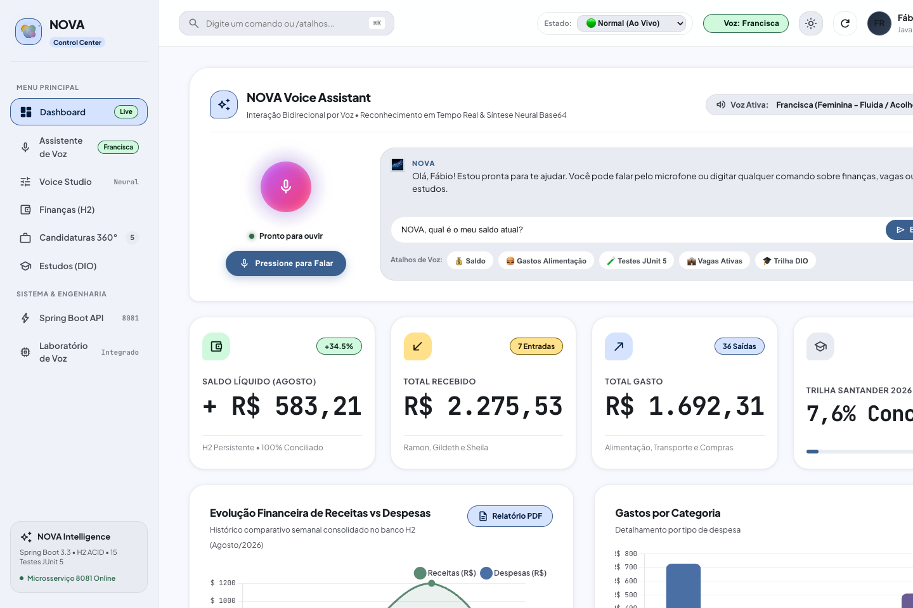
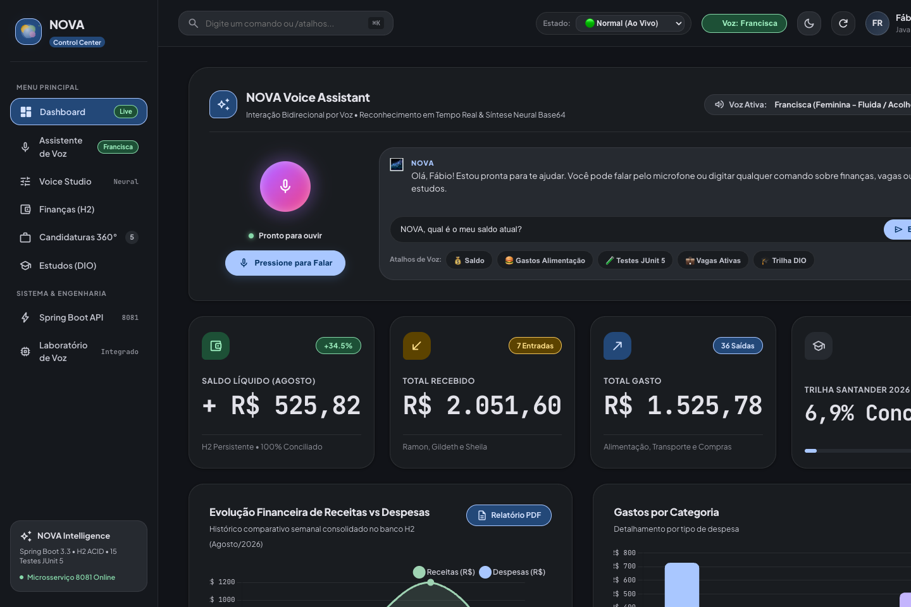
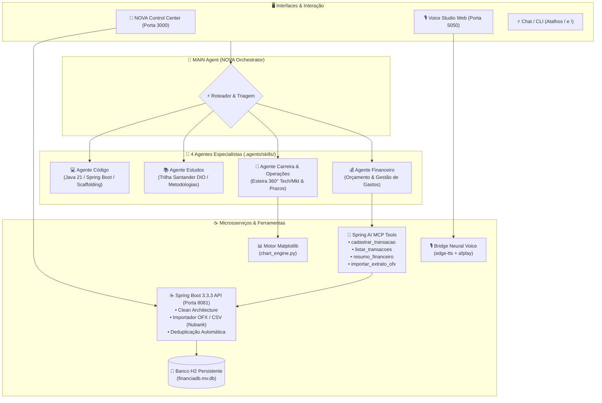

# 🌌 NOVA — Sistema Multi-Agente Pessoal & Profissional

[](https://github.com/fabiorodrigues-tech-dev/NOVA/actions)


Bem-vindo ao ecossistema **NOVA**, seu ponto central de inteligência, produtividade e desenvolvimento profissional em arquitetura multi-agente, integrando o **Gemini via Google Antigravity**, microsserviços **Java 21 / Spring Boot 3** com Clean Architecture, **Model Context Protocol (MCP)**, **Voz Neural Humana** e o **NOVA Control Center** (Dashboard Visual Unificado com Material 3 Expressive e Living Shader).

---

## 📄 Manual de Engenharia & Arquitetura de Software
Consulte a documentação técnica consolidada em PDF com diagramas, princípios SOLID, especificações MCP e suíte de testes:
- 📑 **[Manual de Engenharia & Arquitetura (PDF Completo)](docs/Manual_Engenharia_e_Arquitetura_NOVA.pdf)**
- 🏆 **[Dossiê Técnico Master (PDF)](docs/dossie_tecnico_nova.pdf)**

---

## 🧭 NOVA Control Center (UI Preview)

O **NOVA Control Center** é a interface executiva do ecossistema, projetada com base no Design System **Material 3 Expressive**, Bento Grid modular, WebGL Living Shader dinâmico, telemetria em tempo real via Chart.js e Voice Orb interativo com síntese neural. Acesse em **[http://nova.local:3000](http://nova.local:3000)** (ou **[http://localhost:3000](http://localhost:3000)**) ou via comando `/dashboard`.

| ☀️ Modo Dia (Light Theme) | 🌙 Modo Noite (Dark Theme) |
| :---: | :---: |
|  |  |
| **Light Theme:** Máxima legibilidade com superfície tonal M3, contraste WCAG AAA e visual limpo para foco diurno. | **Dark Theme:** Glassmorphism profundo, Living Shader WebGL reativo, chips vibrantes e conforto visual. |

---

## 👥 Agentes Especialistas Integrados (`.agents/skills/`)
1. 💼 **`agente-carreira-e-operacoes`**: Gestão 360° de candidaturas (Tech/Dev e Marketing/Audiovisual), follow-ups e rotinas diárias.
2. 💻 **`agente-codigo`**: Engenharia Back-end em Java 21, Spring Boot 3, Clean Architecture, scaffolding e suíte JUnit 5.
3. 📚 **`agente-estudos`**: Trilha Santander 2026 DIO, aceleração de aprendizado com Técnica Feynman e flashcards técnicos.
4. 💰 **`agente-financeiro`**: Gestão orçamentária, inteligência preditiva (Burn Rate), parser OFX/CSV e Caixinhas Nubank.

---

## ⚡ Central de Atalhos Rápidos (`/` e `!`)
Consulte o guia completo em [`COMANDOS.md`](file:///Users/fabioandre/Downloads/nova:/COMANDOS.md). Você pode usar atalhos rápidos diretamente no chat:

- 🧭 **Central:** `/dashboard` (ou `/painel`), `/atalhos` (ou `!atalhos`), `/menu`, `/ajuda`, `/status`.
- 💼 **Carreira:** `/candidatura [link]`, `/vagas`, `/pitch [empresa]`, `/cv`.
- 📚 **Estudos (DIO):** `/estudos`, `/feynman [tópico]`, `/desafio [tema]`, `/manual`.
- 💰 **Finanças:** `/saldo`, `/extrato`, `/gastos [categoria]`, `/financeiro [mês]`.
- 💻 **Código:** `/testes`, `/review [arquivo]`, `/scaffold [Feature]`.
- 🗂️ **Operações & Foco:** `/dia`, `/semana`, `/foco`.
- 🎙️ **Voz & Studio:** `/studio`, `/voz`, `/voz [nome]`.

---

## 🏗️ Diagrama de Arquitetura Multi-Agente & Serviços



---

## 🏛️ Árvore de Arquivos do Repositório

```text
nova/
├── .github/workflows/ci.yml         # 🔄 Pipeline CI/CD GitHub Actions (Java 21, Maven & Python)
├── AGENTS.md                        # Identidade e regras do MAIN Agent (Orquestrador central)
├── COMANDOS.md                      # Central de atalhos rápidos (/ e !)
├── start-all.sh                     # 🚀 Script de inicialização unificada (Spring Boot, Dashboard, Voice Studio)
├── stop-all.sh                      # 🛑 Script de parada limpa de todos os serviços
├── nova-blueprint.md                # Planejamento arquitetural original (referência histórica)
├── nova-status.md                   # Estado real, componentes, serviços e roadmap
├── sobre-mim.md                     # Memória pessoal (objetivos, projetos, finanças e carreira)
├── README.md                        # Guia geral do workspace
├── logs/                            # Diretório de logs em background (financeiro.log, dashboard.log, voz.log)
│
├── dashboard/                       # 🧭 FASE 7: NOVA Control Center (Material 3 Expressive)
│   ├── index.html                   # Bento Grid semântico e responsivo
│   ├── styles.css                   # Living Shader, Glassmorphism e Dark Mode profundo
│   ├── app.js                       # Lógica reativa, Chart.js e Voice Orb interativo
│   └── server.py                    # Servidor Web local na porta 3000
│
├── voz/                             # 🎙️ FASE 6: Camada de Voz Neural Humana (Voice AI Layer)
│   ├── config_voz.json              # Configuração ativa de voz (Antônio, Francisca, etc.)
│   └── scripts/
│       ├── voice_studio_app.py      # Voice Studio Web App (Porta 5050 - Google Store Layout)
│       ├── nova_voice_bridge.py     # Bridge de escuta e síntese neural edge-tts + afplay
│       └── configurar_voz.py        # Menu interativo no terminal
│
├── carreira/                        # 💼 Módulo de Carreira & Candidaturas 360° (2 Trilhas Segregadas)
│   ├── base/                        # Bases oficiais de Currículo e Portfólio
│   │   ├── dev/                     # Trilha Tech: curriculo_base_dev.md e PDFs oficiais (PT/EN)
│   │   └── marketing_audiovisual/   # Trilha Audiovisual: portfolio_filmmaker_dados.md, PDF Portfólio e CV Base
│   ├── scripts/                     # Geradores PDF (Harvard Tech / ATS) e DOCX
│   ├── templates/                   # Templates de análise de match e cover letter
│   └── vagas_analisadas/            # Esteira segregada por trilha de atuação
│       ├── tech_dev/                # Vagas TI/Dev (Capgemini, Accenture, Deloitte, FullStack)
│       └── marketing_audiovisual/   # Vagas Audiovisual e Marketing (Gummy, Aposta Ganha, RIO AVE, Grupo Luck)
│
├── estudos/                         # 📚 Trilha Santander 2026 DIO & Guias
│   ├── trilha_tracker.md            # Rastreador oficial da Trilha Santander DIO
│   └── guia_estudos_nova/           # Dossiê e Manual de Engenharia em PDF de 6 páginas
│
├── financeiro/                      # 💰 Módulo Financeiro Oficial (OFX, Caixinhas e Relatórios)
│   ├── extratos_ofx/                # Extratos bancários oficiais em .ofx do Nubank
│   ├── investimentos_caixinhas/     # Prints e dados da Reserva de Emergência e Fundo do Casal
│   └── relatorios_pdf/              # Relatórios executivos visuais em PDF compilados
│
├── scripts/                         # 📊 Motor Central de Gráficos e Relatórios
│   ├── chart_engine.py              # Motor Matplotlib (Match, Salário, Portfólio, Despesas, Balanço)
│   ├── gerar_manual_estudos_pdf.py  # Compilador do Manual Técnico em PDF
│   └── gerar_relatorio_financeiro_pdf.py # Gerador de relatório financeiro executivo
│
├── .agents/
│   └── skills/
│       ├── agente-codigo/                 # Especialista Java 21 / Spring Boot 3 / Clean Architecture
│       ├── agente-estudos/                # Especialista Trilha Santander 2026 DIO / Metodologias ativas
│       ├── agente-carreira-e-operacoes/   # Especialista em Candidaturas 360°, Follow-ups e Rotinas
│       └── agente-financeiro/             # Especialista em Gestão Orçamentária e Balanço Financeiro
│
└── java-services/
    └── agente-financeiro/           # Microsserviço Back-end Java 21 + Spring Boot 3 + Spring AI (MCP)
        ├── data/financiadb.mv.db    # Banco de dados H2 persistente em arquivo
        └── run-tests.sh             # Suíte de testes automatizados JUnit 5 (40 testes - 100% sucesso)
```

---

## 🗺️ Roadmap de Evolução — 9 Fases 100% Concluídas

| Fase | Título | Status | Principais Tecnologias & Entregas |
|:---:|---|:---:|---|
| **1** | Multi-Agent Orchestration | ✅ 100% | Antigravity AI Orchestrator, 4 Agentes Especialistas (`.agents/skills/`) |
| **2** | Java 21 & Clean Architecture | ✅ 100% | Spring Boot 3.3.3, Domain Models, Repository Pattern, Banco H2 Persistente |
| **3** | Spring AI & Model Context Protocol | ✅ 100% | Tools MCP `@Tool` para manipulação autônoma de dados orçamentários por IA |
| **4** | Esteira 360° Tech & Audiovisual | ✅ 100% | 8 Candidaturas completas (PDF Harvard Tech ATS, DOCX timbrado, Pitches) |
| **5** | Motor Gráfico Executivo & Relatórios | ✅ 100% | `chart_engine.py` (Matplotlib), Relatórios Visuais PDF, Dossiê Santander DIO |
| **6** | Interface de Voz Neural Humana | ✅ 100% | Síntese de alta fidelidade (`edge-tts` + `afplay`), Voice Studio Web (Porta 5050) |
| **7** | NOVA Control Center (Dashboard M3) | ✅ 100% | Bento Grid, Living Shader Canvas, Material 3 Expressive, Chart.js (Porta 3000) |
| **8** | CI/CD GitHub Actions & Parser OFX | ✅ 100% | `.github/workflows/ci.yml`, Parser OFX/CSV Nubank com deduplicação nativa |
| **9** | Inteligência Preditiva & Projeção | ✅ 100% | Burn Rate diário, Projeção de Fechamento, Alertas Preditivos e Tool MCP |

